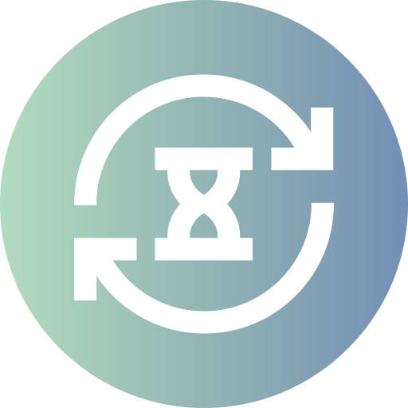

# To run:

`composer install`

`npm install`

Add .env file with correct values.

Turn on apache and mysql.

`npm run dev`

`php artisan migrate`

`php artisan db:seed`

`php artisan serve`

# Program dongles
**_Example for station 1_**
## Initial status

There hasn't been any traffic yet.

## Ready

The station sends `{"ping":"ping"}` on the topic `kiosk/pi1/ping` and is resend within 30 seconds.

## No connection

No ping from station for more than 30 seconds.

## Busy

The station sends `{"status":"busy"}` on the topic `kiosk/pi1/status`.

## Done

The station sends `{"status":"ack"}` on the topic `kiosk/pi1/status`.

## Error

The station sends `{"status":"nack"}` on the topic `kiosk/pi1/status`.

